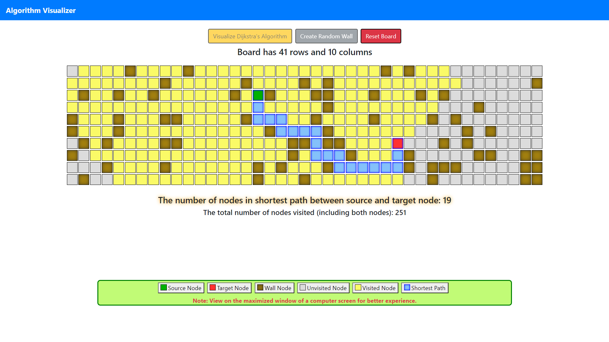
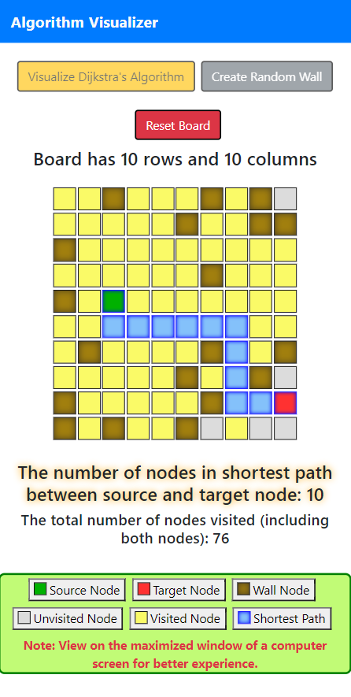

# Algorithm Visualizer

### Features

- Visualize Dijkstra's pathfinding algorithm
- Create/remove new wall nodes on the board
    - using mouse click
    - using `Create Random Wall` button
- Reset board to restart the source and target nodes

### Screenshots

#### Algorithm Visualizer (Web View)

#### Algorithm Visualizer (Mobile View)

### To Do

- [ ] Add A* algorithm
- [ ] Add BFS and DFS algorithm
- [ ] Add button to switch between animation speed
- [ ] Allow user to set source and target node